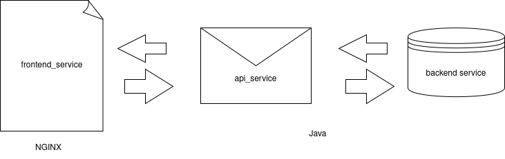

# Zero-Trust-Security-In-Kubernetes

This project demonstrates the practical implementation of the Zero Trust security model in a Kubernetes-based microservices environment.

The application consists of three services (frontend, API, and backend) deployed in a local Kubernetes cluster using Minikube. Secure communication between services is achieved using a service mesh (Istio or Linkerd) with mutual TLS (mTLS) for authentication and encryption.

Additional security mechanisms include Role-Based Access Control (RBAC) for access management and Kubernetes Network Policies for traffic segmentation. An NGINX Ingress Controller is used as the entry point for external traffic.

The project also includes a set of security tests to validate:

* authorized service-to-service communication
* blocked unauthorized access between services
* enforcement of RBAC policies
* encrypted communication via mTLS
* protection against traffic interception

This repository serves as a practical example of applying Zero Trust principles in modern cloud-native systems.

## Application Workflow

### Frontend Service
- Receives HTTP requests from users via the NGINX Ingress Controller.
- Calls the API service to fetch or update data.

### API Service
- Serves as the middle layer between frontend and backend.
- Handles business logic and orchestrates calls to the backend service.
- Authenticates requests from the frontend using service identity via mTLS.

### Backend Service
- Exposes endpoints only accessible by the API service.
- mTLS ensures that only authorized services can communicate with it.

### Flow Diagram
